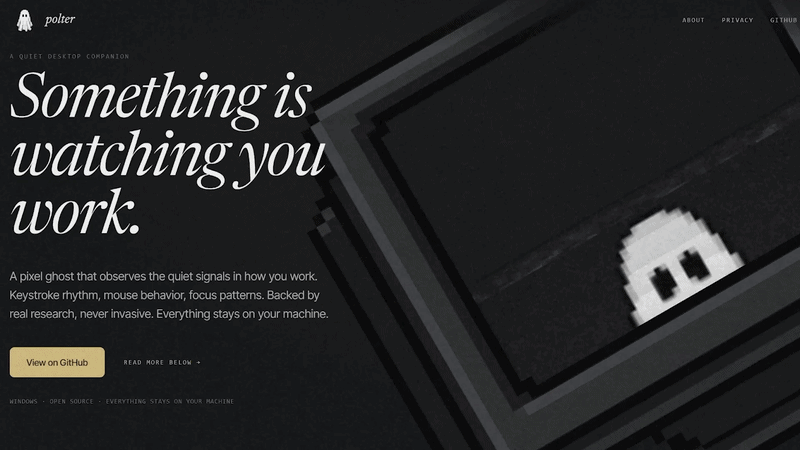

# Polter

A quiet desktop companion that watches how you work and tells you what it sees.

Windows 10/11 · [BSL 1.1](LICENSE) · Everything stays on your machine

---

<p align="center">
  
</p>

---

## What is Polter

Polter is a small pixel ghost that lives on your Windows desktop as a transparent overlay. It watches how you work — keystroke rhythm, mouse behavior, focus patterns — and builds a personal model of your normal over time. When it notices something worth saying, it tells you through a chat bubble. One sentence. Maybe two.

The ghost's mood mirrors yours. When you're focused, it's calm. When you're rushing, it gets restless. When you're exhausted, it droops. You understand how you're doing by looking at how it's doing.

No account. No cloud. No content ever captured.

---

## What Polter sees

- Keystroke timing and rhythm — not which keys
- Mouse speed, path, jitter, and idle gaps
- Which app is active and for how long
- Window and tab count
- Save frequency, undo rate, deletion ratio
- Notification response speed
- System state: battery, brightness, audio device
- Session timing, breaks, and work patterns

## What Polter never sees

- ~~The words you type~~
- ~~Passwords or sensitive input~~
- ~~Websites you visit or tab contents~~
- ~~File names, paths, or document contents~~
- ~~Emails, messages, or conversations~~
- ~~Anything sent to a server or third party~~

---

## How it works

**1. Install it.** Download Polter. A small ghost appears on your desktop.

**2. Forget about it.** Polter watches your patterns silently. Keystroke timing, mouse rhythm, app switching. Never content.

**3. It notices.** When Polter sees something worth saying, it tells you. A sentence about your focus pattern, a note about your afternoon slump, a comparison to last Tuesday.

---

## Download

Download the latest `-setup.exe` from [GitHub Releases](https://github.com/hyowonbernabe/Polter/releases/latest).

Run it. Standard Windows installer — next, next, done. Polter appears in your system tray and a small ghost shows up on your desktop.

An `.msi` installer is also available on the releases page for IT/enterprise deployment.

---

## AI setup (optional)

Polter needs an AI model to turn your behavioral patterns into written observations. Without one, the ghost still reflects your state — it just won't speak.

**Cloud (recommended for now):**
1. Get a free API key from [OpenRouter](https://openrouter.ai/keys)
2. Paste it during onboarding, or later in Settings
3. Polter sends a short plain-language behavioral description per insight — never raw data, never content

**Local (coming soon):**
Ollama support is on the roadmap. Fully private, nothing leaves your device.

**No AI at all:**
Skip the key entirely. The ghost still tracks your state, changes mood, and populates the dashboard. It just won't generate insight bubbles.

---

<details>
<summary><strong>Building from source</strong></summary>

### Prerequisites

- [Rust](https://rustup.rs/) (latest stable)
- [Node.js](https://nodejs.org/) 20+
- Tauri CLI: `cargo install tauri-cli`

### Development

```bash
npm install
npm run tauri dev
```

### Production build

```bash
npm run tauri build
```

This produces both a `-setup.exe` (NSIS) and `.msi` installer in `src-tauri/target/release/bundle/`.

</details>

---

## Uninstall

Remove Polter from **Settings > Apps** (or Add/Remove Programs). To delete all stored data, remove the folder at `%APPDATA%\Polter\`. Your API key is stored in Windows Credential Manager — search "Credential Manager" in Start, look under Generic Credentials for Polter, and remove it.

---

## Privacy

Polter captures timing and behavioral metadata only. It never records which keys you press, what's on your screen, or the content of anything you do. Raw input events are aggregated in memory every 60 seconds and then thrown away. Only the computed rhythm is stored.

Everything stays in `%APPDATA%\Polter\` on your machine. The one exception: if you set up an OpenRouter API key, Polter sends a short plain-text behavioral description (like "typing speed 35% above your normal pace") to generate insight text. No raw data, no content, no personal identifiers are included.

You can delete all collected data from Settings at any time. For the full breakdown of every signal and how it's handled, see [docs/DATA.md](docs/DATA.md).

---

## Status

Most of the core product is built. Here's where things stand:

| Group | What | Status |
|---|---|---|
| Foundation | Window, tray, single instance, click-through | Done |
| Data pipeline | Sensors, ring buffer, aggregation, SQLite | Done (2 minor sensors deferred) |
| Baseline and state machine | EMA baseline, 7-state classifier, anomaly detection | Done |
| Creature | All 7 mood sprites, physics, throw, glow, idle behavior | Done |
| Controls | Sleep mode, privacy mode, auto-sleep schedule | Done |
| AI inference | OpenRouter integration, prompt construction, response handling | Done (Ollama deferred) |
| Chat bubbles | Bubble UI, positioning, all 10 insight types, deduplication | Done |
| Dashboard | Activity chart, state breakdown, insight history, personal bests | Done |
| Settings | Full settings panel, API key, creature config, data controls | Done |
| Onboarding | Welcome, tier disclosures, AI choice, summary | Done |
| Polish | Drag/throw physics done; hover, click reactions, context menu in progress | In progress |

See [docs/ROADMAP.md](docs/ROADMAP.md) for the full checklist.

---

## Tech stack

| Layer | Technology |
|---|---|
| App shell | Tauri 2 (Rust + React/TypeScript) |
| Input capture | rdevin (Rust), separate child process |
| System signals | windows-rs |
| AI inference | OpenRouter (Ollama planned) |
| Storage | SQLite (WAL mode) |
| Sprite rendering | HTML canvas, pixelated scaling |

Architecture details in [docs/ARCHITECTURE.md](docs/ARCHITECTURE.md). Full tech rationale in [docs/TECHSTACK.md](docs/TECHSTACK.md).

---

## License

[Business Source License 1.1](LICENSE). Converts to MIT on 2030-05-04.

You can use, modify, and redistribute Polter freely. The one restriction: you can't offer it as a hosted or embedded service that competes with Polter. On the change date, that restriction drops and it becomes MIT.

---

## Credits

Built by [Hyowon Bernabe](https://www.hyowonbernabe.me) and [Krenz Casilen](https://github.com/xPking23).
